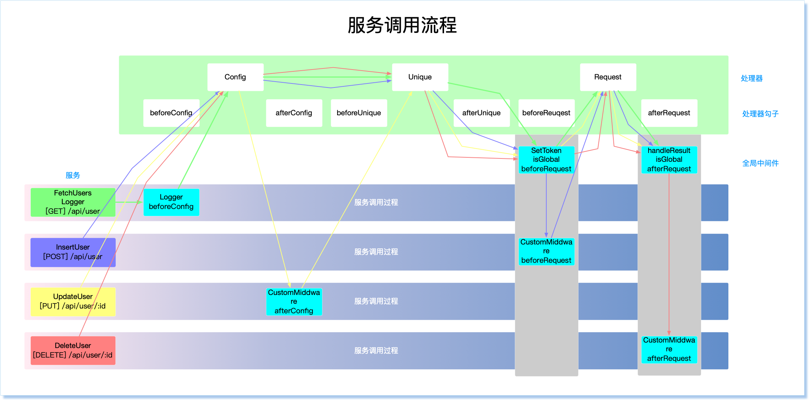

# WuhaoNetwork

[中文](README_CN.md) | English

Pipeline-based Request Management with Orderly Management Service

> Pipeline-based, referring to the request-initiation process that resembles a pipeline, with requests flowing through like water.

> Orderly, managing services in a simple and orderly manner while also supporting reuse.

## Why this Framework?
In projects that involve network requests, there are several common patterns:

### Simple and Brute Force
Typically, network requests are made using fetch\axios by pasting in the URL directly at the place where the request is needed.

* Pros: Direct and convenient, as one can simply paste the API URL in the business logic.
* Cons: Not conducive to reuse, as each place requires the same request to be written; this gets mixed in with many business logic concerns.

### Moderate Abstraction
Moderate abstraction involves creating exports of corresponding methods or instances for the project.

* Pros: Easy to reuse functionality to a certain extent.
* Cons: This approach mainly focuses on abstracting the process of initiating API requests, without sufficient attention paid to the characteristics of the service itself.

### Detailed Configuration
Preconfigured service interfaces with personalized settings, with the only thing that needs to be passed along in the calling logic being the business parameters.

* Pros: More control over service management, with lower coupling to business logic and better reuse potential.
* Cons: Increased learning curve, and team-wide adoption requires standard support to be effective.

> This framework belongs to the third category - detailed configuration - and also supports customizable intervention at any point in the interface lifecycle. Users can configure their own processor, middleware, and service setup to create a matrix management of their services.

## Functionality
* Centralized management of interface configuration information
* Customizable expansion of service flow steps
* OpenApi/AsyncApi specification-based bulk conversion of data to interface lists and entity declarations, requiring use of a https://github.com/kiwh77/wuhao-sequence
* Interface list simulation server startup
* Customizable generation of templates


## setup

```sh
# pnpm
pnpm add wuhao-network
# yarn
yarn add wuhao-network
# npm
npm install wuhao-network -S
```

## use

```ts
// network.ts
import { createNetwork } from 'wuhao-network'
import services from './services'
import middlewares from './middlewares'

const network = createNetwork({
  services,
  middlewares: [...middlewares, {
    name: 'TEMP_MIDDLEWARE',
    at: before(ProcessorType.request),
    handle (ctx, env) {
      // do some thing
    }
  }]
})

network.emit.on('')

export default network

// main.ts when Vue3
import { createApp } from 'vue'
import App from './App.vue'
import WuhaoNetwork from './network'

createApp(App).use(WuhaoNetwork).mount('#app')

// services.ts
import { Logger } from './middlewares'

export default [
  ['FetchUsers', 'get', '/api/user', {
    middlewares: [Logger],
    default: {
      params: {
        pageSize: 10,
        pageNum: 1
      }
    }
  }],
  ['InsertUser', 'post', '/api/user', {
    middlewares: ['Logger']
  }],
  ['UpdateUser', 'put', '/api/user/:id', {
    customData: 'some data of any type'
  }],
  ['DeleteUser', 'delete', '/api/user/:id'],
]

// middlewares.ts
import { useMiddleware } from 'wuhao-network'

export const Logger = useMiddleware({
  name: 'Logger',
  at: after(ProcessorType.request),
  handle(env, ctx) {
    console.log('request  ：', ctx.params)
    console.log('response ：', ctx.response)
  }
})

export default [
  {
    name: 'SetToken',
    isGlobal: true,
    at: before(ProcessorType.request),
    handle(env, ctx) {
      if (!ctx.config) ctx.config = {}
      if (!ctx.config.headers) ctx.config.headers = {}
      ctx.config.headers.Authorization = 'TOKEN'
    }
  }
]

// place of use
import { useFetch, useService } from 'wuhao-network'

useFetch('FetchUsers', { params: { pageSize: 50, pageNum: 1 }}).then(res => {
  // ...
})

// temp
useService({
  url: '/api/temp',
  method: 'post'
})({
  data: {
    arg: 'xxx'
  }
}).then(res => {
  // ...
})

// in modules
// modules/services.ts
export const updateEntity = useService({
  url: '/api/update/entity/:id',
  method: 'put'
})

// place of use in module
updateEntity({
  path: {
    id: 'ID'
  },
  data: {
    name: 'NAME'
  },
  params: {
    t: Date.now()
  }
}).then(res => {
  // ...
})

// functional use
export const insertEntity = useService(['post', '/api/insert/entity'], 'data')

insertEntity({
  name: 'NAME',
  other: 'OTHER'
})
```

## core concept

### flow chart





### Pipe Type  

The pipe acts as a filter through the various processors in order, with requests flowing through each processor like water, and the result of the request being processed.  
There are currently three built-in processors: 
```
ConfigProcessor -> UniqueProcessor -> RequestProcessor
```

In real business development, processors can be added or replaced at any location as needed, see [Custom Processors](#Custom processors).  
 
It also supports the hook before and after the processor, which can add middleware before and after any processor to execute business logic 


### Service Registration
To register the service first, and invoke it directly in the specific use place, has the following advantages:  
* Easy to reuse, service one place configuration, multiple use  
* Easy to maintain, as long as you modify one place, many places take effect 

#### Centralized registration

```ts
// services.ts

export default [
  // form one
  ['SERVICE_NAME', 'REQUEST_METHOD', 'REQUEST_URL', {
    middlewares: [ ... ],
  }],
  // form two
  {
    name: 'SERVICE_NAME',
    method: 'REQUEST_METHOD',
    url: 'REQUEST_URl',
    middlewares: [ ... ]
  }
]

```

#### Business module registration  
If service modules are clearly distinguished, such as front-end micro-modules based on services, each module manages its own services independently and can be directly configured as functional direct invocation  
 
In this way, you can also enjoy the application's global configuration for wuhao-network 

```ts
// xx_modules/services.ts
import { useService } from 'wuhao-network'

export const FUNC_NAME_A = useService(['SERVICE_NAME', 'REQUEST_METHOD', 'REQUEST_URL', {
    middlewares: [ ... ],
  }])

export const FUNC_NAME_B = useService({
    name: 'SERVICE_NAME',
    method: 'REQUEST_METHOD',
    url: 'REQUEST_URl',
    middlewares: [ ... ]
  })

```

#### Service structure  
Service here means to configure the service related information, can be in ` types/compose/services. In which s ` ` iService ` view to the new structure 

```ts
/**
 * service name
 */
name?: string;
/**
 * service url
 */
url: string;
/**
 * service method
 */
method: Method | string;
/**
 * service tag
 */
tag?: Array<string> | string;
/**
 * Custom data, which follows the entire request flow, can be picked up in the middleware for personalized operation 
 */
customData?: {
    [key: string]: any;
};
/**
 * description
 */
description?: string;
/**
 * default params
 */
default?: Pick<RequestParams, 'path'> & Pick<RequestParams, 'params'> & Pick<RequestParams, 'data'> & {
    /**
     * Mixed mode  
     * last: Default, passed as primary when used  
     * default: The default parameter is primary 
     */
    assign?: 'default' | 'replace' | 'mixin';
};
/**
 * middleware
 */
middleware?: Array<iMiddleware | string>;
```

### processor

Each processor is responsible for processing a single function

#### Built-in processor

##### ConfigProcessor

This handler will check the service information of this request

##### UniqueProcessor
If interval is set, the same parameter is sent only once within the specified time

##### RequestProcessor
This handler is the last place to initiate the request, which is currently being integrated with Axios

#### Processor hook
There is a hook before and after the processor, respectively for 'before' and 'after' plus the initial letter of the processor name, can also be used when the splicing function directly splicing

```ts
import { Before, ProcessType } from 'wuhao-network'

{
  middlewares: [
    {
      name: 'NAME',
      at: Before(ProcessType.request), // or 'beforeRequest'
      handle(ctx) {}
    }
  ]
}

```

#### Custom processors  
If the built-in processor cannot meet service requirements, you can customize the processor by replacing the current processor or inserting a new processor to a specified location  
 
The processor needs to inherit BaseProcessor and implement iProcessor 

```ts
export class CustomProcessor extends BaseProcessor implements iProcessor {
  // The actual name of the processor will also have the corresponding before and after check marks 
  name = 'custom'

  async handle(ctx: Context, env: Env) {
    
    //... logic

    // Call the base class handle, which the middleware handles in this method
    super.handle(ctx, env)
  }
}

```

* Replacement processor
```ts

import { createNetwork, ProcessorType } from 'wuhao-network'

const network = createNetwork()

// Replace the processor named unique with a new one
network.processor.replace(ProcessorType.unique, CustomProcessor)
network.processor.replace('unique', CustomProcessor)
Network. The processor. The replace (1, CustomProcessor) / / for the processor that corresponds to the subscript 1

```

* Insert a new processor
```ts

import { createNetwork, ProcessorType } from 'wuhao-network'

const network = createNetwork()

// Insert a new processor in front of the request processor
network.processor.before(ProcessorType.request, CustomProcessor)
network.processor.before('request', CustomProcessor)
before(2, CustomProcessor) // 2 indicates the subscript of the processor

// Insert a new processor at the end of the processor list
network.register(CustomProcessor)

```

* Delete processor

```ts
import { createNetwork, ProcessorType } from 'wuhao-network'

const network = createNetwork()

// Delete the unique handler
network.processor.remove(ProcessorType.unique)
network.processor.remove('unique')
network.processor.remove(1) // 1 indicates the corresponding subscript in the processor
```


### Middleware
Middleware is the processor that is invoked during the initiation of a service request. The mechanism of middleware makes the capabilities that services can be configured more personalized, and also increases encapsulation and reusability.

#### Middleware architecture

```ts
{
/ * *
* Middleware execution location, same as processor check sub name, e.g. 'beforeRequest' or before(ProcessorType.request)
* /
at: string
/ * *
* Middleware name
* /
name: string
/ * *
* Global middleware. Registration as global middleware applies to all services
* /
global? : boolean
/ * *
* Middleware processing functions
* /
handle(ctx: Context, env? : Env): Promise<Error | void> | void | Error
}
```

#### Global middleware
The global middleware is usually configured where the network instance is generated

``` ts
// middlewares.ts

// Method one, directly return the corresponding structure object
export const SetToken = {
  name: 'SetToken',
  global: true,
  at: Before(ProcessType.request),
  handle(ctx) {
    if (! ctx.config) ctx.config = {}
    if (! ctx.config.headers) ctx.config.headers = {}
    ctx.config.headers.Authorization = 'TOKEN'
  }
}
// Method two, use useMiddleware to register, then use the name
import { useMiddleware } from 'wuhao-network'
useMiddleware({name: 'SetToken',
  global: true,
  at: Before(ProcessType.request),
  handle(ctx) {
    if (! ctx.config) ctx.config = {}
    if (! ctx.config.headers) ctx.config.headers = {}
    ctx.config.headers.Authorization = 'TOKEN'
  }
})

// network.ts
import { SetToken } from './middlewares'

export const network = createNetwork({
  middlewares: [SetToken]
  // or
  middlewares: ['SetToken']
})
```

#### Service personalization middleware

```ts

const Logger = {
  name: 'Logger',
  at: Before(ProcessorType.request)
  handle(ctx) {
    console.log('Begin Request : ' ctx.params)
  }
}

export const FUNC_NAME = useService(['SERVICE_NAME', 'SERVICE_METHOD', 'SERVICE_URL', {
  middlewares: [ Logger ]
}])

```